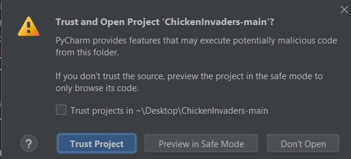
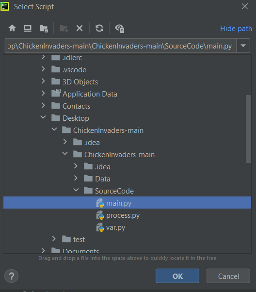
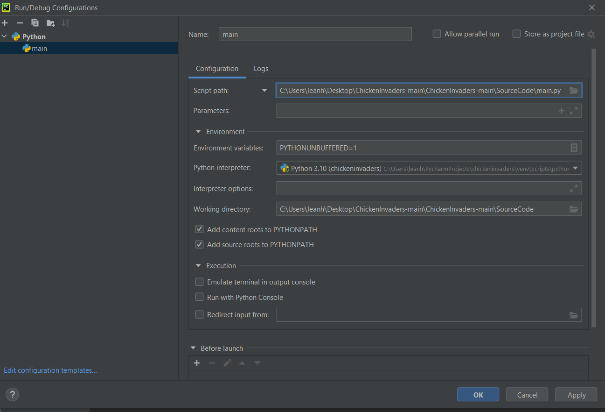
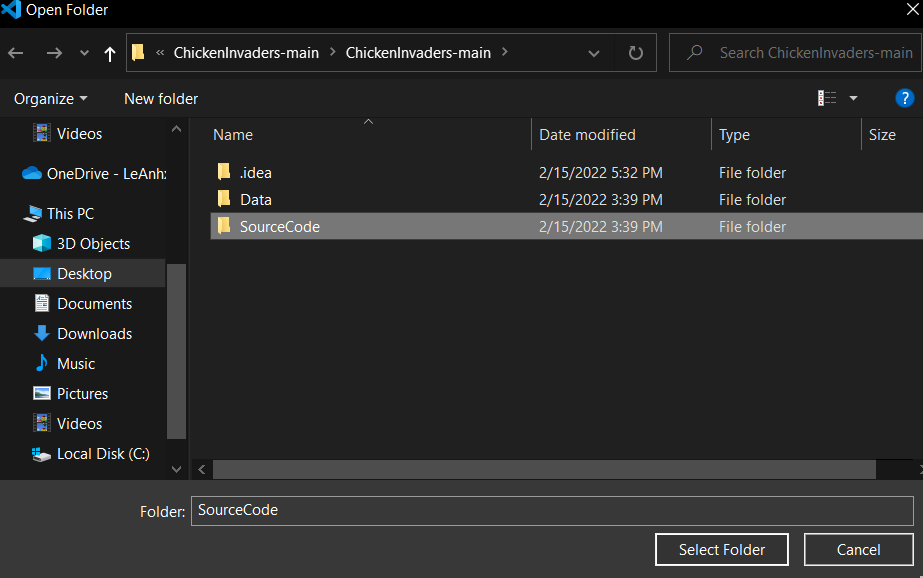

# ChickenInvaders
## Đồ Án Python
### Đề Tài: GAME BẮN GÀ (CHICKEN INVADERS)
Sinh Viên Thực Hiện :
- Lê Hoàng Anh (N19DCCN005)
- Nguyễn Văn Kiên (N19DCCN077)
#### Trong bài làm có 1 số module, thư viện không có sẵn cần cài thêm:
```
pip install pygame
```
#### Cách chạy trên Pycharm: 
- Tải code về sẽ có tên là ChickenInvaders-main.zip
- Giải nén file zip rồi mở Pychram mở folder vừa giải nén ra được (như hình bên dưới).


- Chọn Trust Project



- Chọn Add Configuation... -> Add new run -> Python
- Chọn Script path là file SourceCode\main.py (như hình bên dưới)



- Chọn working directory là folder SourceCode (như hình bên dưới)



- Chọn Ok rồi chạy bình thường

#### Cách chạy trên Visual Code: 
- Tải code về sẽ có tên là ChickenInvaders-main.zip
- Giải nén file zip rồi mở Visual Code mở folder SourceCode trong folder vừa giải nén ra được (như hình bên dưới).



- Run file main.py
